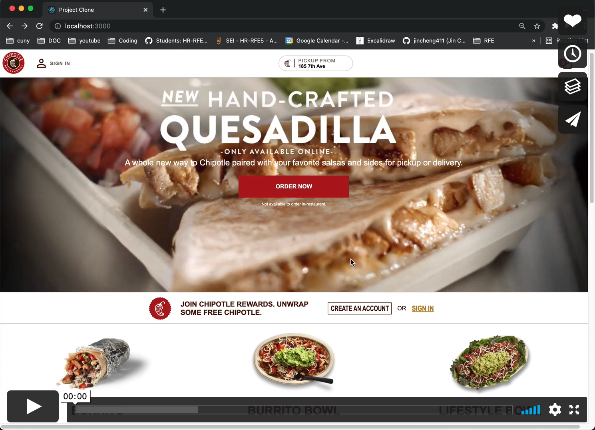

## Project-Clone
### Table of Contents

1. [Description](#description)
2. [Technologies](#technologies)
3. [Requirements](#requirements)
4. [Demo](#demo)
5. [How to run it](#how-to-run-it)

### Description
> A mobile responsive web application bulit with React and Node.js

### Technologies

### Requirements
- Node v14+
- React 17
- Express
- Jest
- MongoDB

### Demo

### How to run it
- [ ] `npm install`
- [ ] `npm start`
- [ ] `npm run server`
